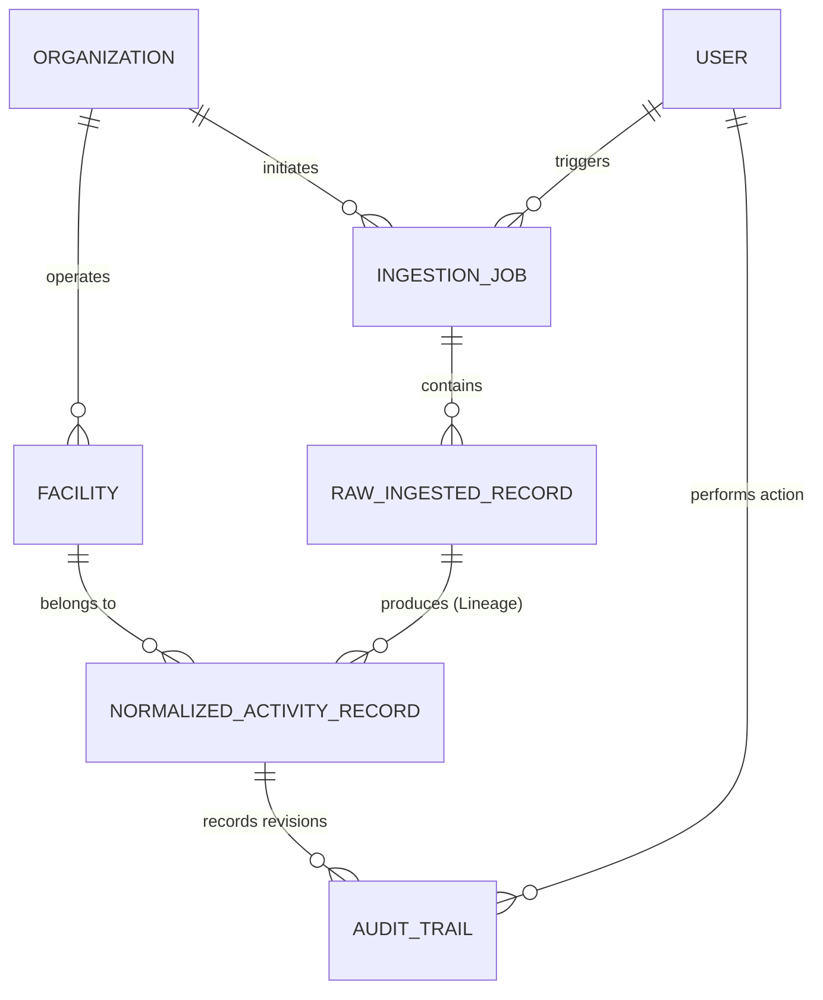

# Environmental Data Model Architecture (MODEL.md)

This document describes the relational database schema and technical architectural design of the Breathe ESG Prototype. It has been built to address the challenges of enterprise multi-source environmental data ingestion, exact calendar proration, and auditability.

---

## 1. Entity Relationship Diagram (ERD)

Our normalized data structure enforces mathematical integrity, source-to-truth lineage, and auditor sign-off controls.

---

## 2. Model Specifications & Design Rationale

### A. Organization (Tenant Control)
- **Purpose**: Enforces hard **multi-tenancy** at the database layer. This ensures that client data (emissions, facilities, audit trails) is fully isolated and secure.
- **Key Fields**: `id`, `name`, `created_at`.
- **Rationale**: Any query to retrieve facilities or normalized ledgers must filter by `organization_id` to prevent cross-tenant data leaks.

### B. Facility (Operating Plants)
- **Purpose**: Represents physical operating plants (e.g., factories, offices, data centers). It acts as the anchor mapping corporate activity (SAP, Utility grids) to regional emission grids.
- **Key Fields**:
  - `plant_code` (e.g., `DE01`, `US02`, `IN03`): Matches the real-world standard plant codes found in SAP material movements and utility service meters.
  - `grid_emission_factor` (Decimal, kg CO2e / kWh): Mapped specifically to the plant's local power grid (e.g. ERCOT for Texas, regional DE grid for Germany, Karnataka state grid for India).
- **Rationale**: Enforcing a distinct plant table allows looking up plant codes from SAP exports and dynamically applying different grid carbon factors to electricity consumption!

### C. IngestionJob
- **Purpose**: Tracks data ingestion pipelines (file uploads or API pulls).
- **Key Fields**: `source_type` (`SAP`, `UTILITY`, `TRAVEL`), `filename`, `status` (`SUCCESS`, `FAILED`), `error_summary`.
- **Rationale**: Provides system administrators with a central monitoring dashboard to isolate parsing exceptions or file structure failures instantly.

### D. RawIngestedRecord (The Source of Truth Lineage)
- **Purpose**: Retains the exact, unmodified raw fields that came from the source file (SAP CSV, PG&E sheet, or Concur JSON) to maintain complete **data lineage**.
- **Key Fields**:
  - `raw_data_text` (TextField with getter/setter JSON property): Retains the original dictionary keys and values.
  - `validation_errors`: Logs detailed engine reports if a row fails parsing or represents an anomaly.
- **Rationale**: An environmental auditor will *never* trust a normalized carbon value unless they can compare it directly with the original SAP transaction list or utility bill. This model forms the bridge between raw files and audit balances.

### E. NormalizedActivityRecord (The Environmental Ledger)
- **Purpose**: The core environmental table. Every row represents a single standardized, carbon-evaluated activity ledger entry.
- **Key Fields**:
  - `scope` (`SCOPE_1`, `SCOPE_2`, `SCOPE_3`): Categorizes emissions.
  - `start_date` / `end_date`: Represents the exact normalized dates. If a utility bill spans March 15 to April 14, the proration engine splits this into two normalized rows: one ending March 31, and one starting April 1.
  - `normalized_quantity` / `normalized_unit`: Standardizes units (e.g., Liters for fuel, kWh for electricity, passenger-km for flight, nights for lodging).
  - `co2e_kg` (Decimal): Standardized carbon equivalent emissions in kilograms.
  - `review_status` (`PENDING_REVIEW`, `SUSPICIOUS`, `APPROVED`, `REJECTED`).
  - `is_locked` (Boolean): Locked read-only state.
  - `audit_seal_hash` (CharField): Tamper-proof cryptographic `SHA256` seal.
- **Rationale**: By enforcing this standardized structure, carbon analysts can run unified queries across fuels, electricity, and travel, while tracking precisely which raw record gave birth to which ledger entry.

### F. AuditTrail (Auditor Revision Log)
- **Purpose**: Tracks every historical change made by analysts.
- **Key Fields**:
  - `changed_fields_text` (TextField storing JSON old vs new diffs).
  - `change_reason`: Enforced mandatory string justification.
- **Rationale**: If an analyst corrects a quantity or maps an unmapped plant code, the system writes a permanent record of the edit. This complete history is displayed in our React "Inspector Panel".

---

## 3. Core Architectural Highlights & Innovations

### I. Mathematical Proration Engine (Scope 2)
Utility bills rarely align with calendar months. The model supports splitting a single billing period into fractional entries across calendar boundaries. If a bill has $Q$ total consumption across $D$ total days, the average daily consumption is $q = Q / D$.
For a month overlapping by $d$ days, the model writes a distinct normalized activity line with:
$$Quantity_{prorated} = q \times d$$
And applies the grid emission factor of the mapped plant, ensuring that quarterly reporting values match calendar realities.

### II. Tamper-Proof Cryptographic Sealing
When an analyst locks approved rows for audit, the system creates a hash of the row content:
$$Hash = SHA256(Scope \ || \ Category \ || \ ActivityType \ || \ Dates \ || \ Quantity \ || \ CO2e \ || \ Factor)$$
This seal is stored in the database. Any unauthorized direct manipulation of database records by database administrators will break the cryptographic integrity checks, immediately alerting auditors.

### III. Dual-Schema Lineage
Retaining raw JSON strings alongside normalized decimal numbers allows side-by-side rendering in the UI. A non-technical auditor can view the exact original SAP columns (like German headers `WERKS` or `BUDAT`) right next to the computed metric carbon outputs, creating absolute trust.
